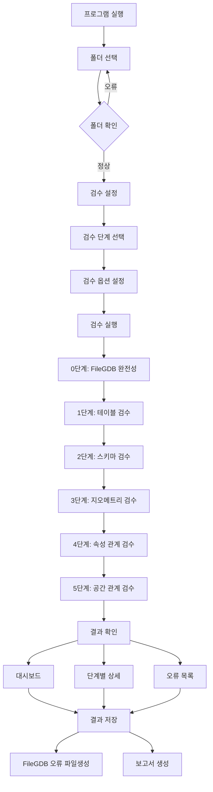

# Spatial Check Pro 사용자 매뉴얼

**버전**: 2.1.0  
**작성일**: 2025-11-18  
**대상**: 국가기본도 DB 검수 담당자

---

## 목차

1. [프로그램 개요](#1-프로그램-개요)
2. [시작하기](#2-시작하기)
3. [주요 화면 설명](#3-주요-화면-설명)
4. [검수 프로세스](#4-검수-프로세스)
5. [검수 결과 확인](#5-검수-결과-확인)
6. [설정 및 관리](#6-설정-및-관리)
7. [문제 해결](#7-문제-해결)
8. [부록](#8-부록)

> 💡 **빠른 시작**: 처음 사용하시나요? [빠른_시작_가이드.md](빠른_시작_가이드.md)를 먼저 확인하세요!

---

## 1. 프로그램 개요

### 1.1 Spatial Check Pro란?

Spatial Check Pro는 File Geodatabase(.gdb) 파일을 검수하는 Windows 데스크톱 애플리케이션입니다. ISO 19157 데이터 품질 표준을 준수하며, 공간정보 데이터의 완전성, 논리적 일관성, 정확도를 검증합니다.

### 1.2 주요 기능

- ✅ **5단계 체계적 검수**: 테이블 → 스키마 → 지오메트리 → 속성 관계 → 공간 관계
- ✅ **ISO 19157 표준 준수**: 국제 표준 기반 품질 검증
- ✅ **실시간 진행률 표시**: 검수 진행 상황 실시간 모니터링
- ✅ **상세한 오류 분석**: 단계별/유형별 오류 통계 및 분석
- ✅ **오류 내보내기**: Shapefile 형식으로 오류 위치 내보내기
- ✅ **검수 보고서 생성**: PDF/HTML 형식 보고서 생성

### 1.3 시스템 요구사항

| 항목 | 요구사항 |
|------|---------|
| 운영체제 | Windows 10 이상 (64비트) |
| 메모리 | 최소 4GB RAM (권장: 8GB 이상) |
| 디스크 공간 | 최소 500MB (검수 결과 저장 공간 별도) |
| .NET 런타임 | .NET 8.0 Runtime |
| GDAL 라이브러리 | 포함됨 (별도 설치 불필요) |

---

## 2. 시작하기

### 2.1 프로그램 실행

1. **실행 파일 위치 확인**
   ```
   publish\SpatialCheckPro.GUI.exe
   ```

2. **프로그램 실행**
   - `SpatialCheckPro.GUI.exe` 더블 클릭
   - 또는 배치 파일 실행

3. **초기 화면 확인**
   - 프로그램이 정상적으로 실행되면 메인 화면이 표시됩니다.

   > 📸 **이미지 삽입 위치**: 초기 실행 화면 스크린샷
   > - 왼쪽 사이드바: 폴더 선택, 검수 진행, 검수 결과, 설정 메뉴
   > - 중앙 영역: 환영 메시지 또는 선택된 화면

### 2.2 첫 실행 시 확인 사항

- ✅ Config 폴더에 검수 규칙 CSV 파일 존재 확인
- ✅ 데이터베이스 파일 생성 확인 (ValidationResults.db)
- ✅ 로그 파일 생성 확인 (Logs 폴더)

---

## 3. 주요 화면 설명

### 3.1 메인 화면 구조

```
┌─────────────────────────────────────────────────────────┐
│  국가기본도 DB 검수 프로그램 v2.1.0                    │
├──────────┬──────────────────────────────────────────────┤
│          │                                              │
│  사이드  │           메인 작업 영역                     │
│  바      │                                              │
│          │                                              │
│  [폴더]  │                                              │
│  [검수]  │                                              │
│  [결과]  │                                              │
│  [설정]  │                                              │
│          │                                              │
└──────────┴──────────────────────────────────────────────┘
```

### 3.2 사이드바 메뉴

#### 3.2.1 폴더 선택
- **기능**: 검수할 FileGDB 폴더 선택
- **사용 시점**: 검수 시작 전
- **동작**: 폴더 선택 다이얼로그 표시

#### 3.2.2 검수 진행
- **기능**: 검수 설정 및 검수 실행
- **사용 시점**: 폴더 선택 후
- **동작**: 검수 설정 화면 표시

#### 3.2.3 검수 결과
- **기능**: 검수 결과 확인 및 분석
- **사용 시점**: 검수 완료 후
- **동작**: 결과 대시보드 및 상세 결과 표시

#### 3.2.4 설정
- **기능**: 프로그램 설정 관리
- **사용 시점**: 언제든지
- **동작**: 설정 창 표시

### 3.3 폴더 선택 화면

> 📸 **이미지 삽입 위치**: 폴더 선택 화면 스크린샷

**주요 요소**:
- **폴더 경로 입력**: 직접 입력 또는 찾아보기 버튼
- **선택된 폴더 미리보기**: 폴더 내 .gdb 파일 목록 표시
- **확인 버튼**: 선택 완료

**사용 방법**:
1. "폴더 선택" 메뉴 클릭
2. 검수할 FileGDB가 있는 폴더 선택
3. 폴더 내 .gdb 파일 목록 확인
4. "확인" 버튼 클릭

### 3.4 검수 설정 화면

> 📸 **이미지 삽입 위치**: 검수 설정 화면 스크린샷

**주요 요소**:
- **검수 단계 선택**: 1~5단계 중 선택
- **검수 규칙 선택**: 각 단계별 세부 규칙 선택
- **검수 옵션**: 병렬 처리, 스트리밍 모드 등
- **검수 시작 버튼**: 검수 실행

**사용 방법**:
1. 검수할 단계 선택 (체크박스)
2. 각 단계별 세부 규칙 확인/선택
3. 검수 옵션 설정 (필요 시)
4. "검수 진행" 버튼 클릭

### 3.5 검수 진행 화면

> 📸 **이미지 삽입 위치**: 검수 진행 화면 스크린샷

**주요 요소**:
- **전체 진행률**: 전체 검수 진행률 표시
- **단계별 진행률**: 각 단계별 진행률 표시
- **현재 작업 표시**: 현재 실행 중인 검수 항목
- **예상 소요 시간**: 남은 시간 표시
- **취소 버튼**: 검수 중단

**진행률 표시 예시**:
```
전체 진행률: ████████░░ 80%
1단계: 테이블 검수        ██████████ 100% 완료
2단계: 스키마 검수        ██████████ 100% 완료
3단계: 지오메트리 검수    ████████░░  80% 진행 중...
   └─ 객체 중복 검사: 1,234/1,500 처리 중
4단계: 속성 관계 검수     ░░░░░░░░░░   0% 대기 중
5단계: 공간 관계 검수     ░░░░░░░░░░   0% 대기 중

예상 소요 시간: 약 5분
```

### 3.6 검수 결과 화면

> 📸 **이미지 삽입 위치**: 검수 결과 화면 스크린샷

**주요 요소**:
- **대시보드 탭**: 전체 검수 결과 요약
- **단계별 탭**: 1~5단계별 상세 결과
- **오류 목록**: 발견된 오류 목록 및 상세 정보
- **통계 차트**: 오류 유형별 통계 그래프
- **내보내기 버튼**: 결과를 파일로 저장

---

## 4. 검수 프로세스

### 4.1 전체 검수 프로세스 흐름

```
┌─────────────────────────────────────────────────────────┐
│                    프로그램 실행                         │
│              (SpatialCheckPro.GUI.exe)                 │
└────────────────────┬────────────────────────────────────┘
                     │
                     ▼
┌─────────────────────────────────────────────────────────┐
│                    폴더 선택                            │
│         검수할 FileGDB 폴더 선택                        │
│         └─ 폴더 내 .gdb 파일 목록 확인                  │
└────────────────────┬────────────────────────────────────┘
                     │
                     ▼
┌─────────────────────────────────────────────────────────┐
│                    검수 설정                            │
│  ┌──────────────────────────────────────────────┐     │
│  │  검수 단계 선택 (1~5단계)                     │     │
│  │  └─ 각 단계별 세부 규칙 확인/선택             │     │
│  │  검수 옵션 설정                                │     │
│  │  └─ 병렬 처리, 스트리밍 모드 등               │     │
│  └──────────────────────────────────────────────┘     │
└────────────────────┬────────────────────────────────────┘
                     │
                     ▼
┌─────────────────────────────────────────────────────────┐
│                    검수 실행                            │
│  ┌──────────────────────────────────────────────┐     │
│  │  0단계: FileGDB 완전성 검사                  │     │
│  │  1단계: 테이블 검수                           │     │
│  │  2단계: 스키마 검수                           │     │
│  │  3단계: 지오메트리 검수                       │     │
│  │  4단계: 속성 관계 검수                        │     │
│  │  5단계: 공간 관계 검수                        │     │
│  └──────────────────────────────────────────────┘     │
│  ┌──────────────────────────────────────────────┐     │
│  │  진행률 표시: 전체/단계별/항목별               │     │
│  │  예상 소요 시간 표시                           │     │
│  │  취소 버튼 (중단 가능)                         │     │
│  └──────────────────────────────────────────────┘     │
└────────────────────┬────────────────────────────────────┘
                     │
                     ▼
┌─────────────────────────────────────────────────────────┐
│                    결과 확인                            │
│  ┌──────────────────────────────────────────────┐     │
│  │  대시보드: 전체 요약 및 통계                  │     │
│  │  단계별 탭: 상세 결과                         │     │
│  │  오류 목록: 발견된 오류 상세 정보             │     │
│  │  통계 차트: 오류 유형별/심각도별 분포         │     │
│  └──────────────────────────────────────────────┘     │
└────────────────────┬────────────────────────────────────┘
                     │
                     ▼
┌─────────────────────────────────────────────────────────┐
│                    결과 저장                            │
│  ┌──────────────────────────────────────────────┐     │
│  │  오류 내보내기: FileGDB 형식                │     │
│  │  보고서 생성: PDF/HTML 형식                   │     │
│  │  데이터베이스 저장: 자동 저장                 │     │
│  └──────────────────────────────────────────────┘     │
└─────────────────────────────────────────────────────────┘
```

**프로세스 다이어그램 (Mermaid 형식)**:



### 4.2 단계별 검수 상세

#### 4.2.1 1단계: 테이블 검수

**목적**: FileGDB의 기본 구조 및 메타데이터 검증

**검수 항목**:
- ✅ 테이블 존재 여부
- ✅ 필수 피처클래스 존재 여부
- ✅ 좌표계(CRS) 지정 여부
- ✅ 지오메트리 타입 일치 여부

**검수 규칙 파일**: `Config/1_table_check.csv`

**예시 결과**:
```
✅ tn_buld (건물) - 정상
✅ tn_rodway_ctln (도로중심선) - 정상
❌ tn_buld_ctpt (건물중심점) - 누락
```

> 📸 **이미지 삽입 위치**: 1단계 검수 결과 예시 화면

#### 4.2.2 2단계: 스키마 검수

**목적**: 테이블의 필드 구조 및 데이터 타입 검증

**검수 항목**:
- ✅ 필드 존재 여부
- ✅ 데이터 타입 일치
- ✅ 필드 길이/정밀도 일치
- ✅ 고유키(UK) 중복 검사
- ✅ 외래키(FK) 참조 무결성
- ✅ 필수값(NN) NULL 검사

**검수 규칙 파일**: `Config/2_schema_check.csv`

**예시 결과**:
```
✅ tn_buld.objectid - 정상 (INTEGER, PK)
✅ tn_buld.bldg_se - 정상 (TEXT, 10)
❌ tn_buld.pnu - 오류: 길이 불일치 (예상: 19, 실제: 20)
```

> 📸 **이미지 삽입 위치**: 2단계 검수 결과 예시 화면

#### 4.2.3 3단계: 지오메트리 검수

**목적**: 지오메트리의 유효성 및 위상 일관성 검증

**검수 항목**:
- ✅ 지오메트리 유효성 (IsValid)
- ✅ NULL/빈 지오메트리 검사
- ✅ 객체 중복 검사
- ✅ 객체 간 겹침 검사
- ✅ 자체 꼬임(자기교차) 검사
- ✅ 슬리버 폴리곤 검사
- ✅ 짧은 객체 검사
- ✅ 작은 면적 객체 검사
- ✅ 스파이크 검사
- ✅ 언더슛/오버슛 검사

**검수 규칙 파일**: `Config/3_geometry_check.csv`

**예시 결과**:
```
✅ 지오메트리 유효성: 10,000개 정상
❌ 객체 중복: 5건 발견
❌ 객체 간 겹침: 12건 발견
❌ 자체 꼬임: 3건 발견
```

> 📸 **이미지 삽입 위치**: 3단계 검수 결과 예시 화면

#### 4.2.4 4단계: 속성 관계 검수

**목적**: 속성값의 정확성 및 논리적 일관성 검증

**검수 항목**:
- ✅ 코드리스트 검사
- ✅ 정규식 검사
- ✅ 값 범위 검사
- ✅ 필수값 NULL 검사
- ✅ 조건부 속성 검사

**검수 규칙 파일**: `Config/4_attribute_check.csv`

**예시 결과**:
```
✅ 건물구분 코드리스트: 9,850개 정상
❌ PNU 형식 오류: 15건 발견
❌ 표고점 높이 범위 초과: 3건 발견
```

> 📸 **이미지 삽입 위치**: 4단계 검수 결과 예시 화면

#### 4.2.5 5단계: 공간 관계 검수

**목적**: 피처 간 공간 관계 및 위상 일관성 검증

**검수 항목**:
- ✅ 점-면 포함 관계
- ✅ 선-면 포함 관계
- ✅ 면-면 포함 관계
- ✅ 면-면 겹침 금지
- ✅ 선 연결성 검사
- ✅ 중심선 속성 불일치 검사

**검수 규칙 파일**: `Config/5_relation_check.csv`

**예시 결과**:
```
✅ 건물중심점-건물 포함 관계: 9,900개 정상
❌ 도로중심선-도로경계면 포함 관계: 25건 오류
❌ 건물-도로경계면 겹침: 8건 발견
```

> 📸 **이미지 삽입 위치**: 5단계 검수 결과 예시 화면

### 4.3 검수 실행 방법

#### 4.3.1 기본 검수 실행

1. **폴더 선택**
   - 사이드바에서 "폴더 선택" 클릭
   - 검수할 FileGDB 폴더 선택
   - 확인 버튼 클릭

2. **검수 설정**
   - 사이드바에서 "검수 진행" 클릭
   - 검수할 단계 선택 (1~5단계)
   - 각 단계별 세부 규칙 확인

3. **검수 시작**
   - "검수 진행" 버튼 클릭
   - 검수 진행 화면에서 진행률 확인

4. **검수 완료 대기**
   - 검수가 완료될 때까지 대기
   - 필요 시 "취소" 버튼으로 중단 가능

#### 4.3.2 고급 검수 옵션

**병렬 처리**:
- 대용량 데이터 처리 시 성능 향상
- 설정에서 활성화 가능

**스트리밍 모드**:
- 메모리 부족 방지
- 대용량 파일 처리 시 자동 활성화

**부분 검수**:
- 특정 단계만 선택하여 검수 가능
- 예: 지오메트리 검수만 실행

---

## 5. 검수 결과 확인

### 5.1 대시보드 화면

> 📸 **이미지 삽입 위치**: 대시보드 화면 스크린샷

**주요 정보**:
- **전체 검수 요약**: 총 오류 수, 경고 수, 정상 항목 수
- **단계별 요약**: 각 단계별 오류 통계
- **오류 유형별 분류**: 오류 유형별 통계 차트
- **심각도별 분류**: CRITICAL, MAJOR, MINOR, INFO

**대시보드 구성**:
```
┌─────────────────────────────────────────┐
│  전체 검수 요약                         │
│  ┌─────┬─────┬─────┐                  │
│  │ 오류│경고 │정상 │                  │
│  │ 45  │ 12  │9,943│                  │
│  └─────┴─────┴─────┘                  │
├─────────────────────────────────────────┤
│  단계별 요약                            │
│  1단계: 테이블 검수      ✅ 정상       │
│  2단계: 스키마 검수      ⚠️  5건 오류  │
│  3단계: 지오메트리 검수  ❌ 25건 오류  │
│  4단계: 속성 관계 검수   ⚠️  10건 오류 │
│  5단계: 공간 관계 검수   ❌  5건 오류  │
└─────────────────────────────────────────┘
```

### 5.2 단계별 상세 결과

#### 5.2.1 오류 목록 확인

각 단계별 탭에서 발견된 오류를 확인할 수 있습니다.

**오류 정보**:
- **오류 ID**: 고유 식별자
- **테이블명**: 오류가 발생한 테이블
- **피처 ID**: 오류가 발생한 피처
- **오류 유형**: 오류 종류
- **심각도**: CRITICAL, MAJOR, MINOR, INFO
- **위치 좌표**: 오류 발생 위치 (X, Y)
- **오류 메시지**: 상세 설명

**오류 필터링**:
- 테이블별 필터
- 심각도별 필터
- 오류 유형별 필터

> 📸 **이미지 삽입 위치**: 오류 목록 화면 스크린샷

#### 5.2.2 통계 차트

**차트 유형**:
- 단계별 오류 수 막대 그래프
- 오류 유형별 파이 차트
- 심각도별 분포 차트
- 시간대별 오류 발생 추이

> 📸 **이미지 삽입 위치**: 통계 차트 화면 스크린샷

### 5.3 오류 위치 확인

#### 5.3.1 오류 내보내기

**Shapefile 형식으로 내보내기**:
1. 검수 결과 화면에서 "내보내기" 버튼 클릭
2. 내보내기 형식 선택 (Shapefile)
3. 저장 위치 선택
4. 내보내기 실행

**내보내기 파일 구조**:
```
QC_Errors/
├── QC_Errors_Point.shp      (점 오류)
├── QC_Errors_Line.shp       (선 오류)
└── QC_Errors_Polygon.shp    (면 오류)
```

#### 5.3.2 GIS 소프트웨어에서 확인

**QGIS에서 확인**:
1. QGIS 실행
2. 원본 FileGDB와 오류 Shapefile 동시 로드
3. 오류 위치 확인 및 원본 데이터와 비교

**ArcGIS에서 확인**:
1. ArcGIS 실행
2. 원본 FileGDB와 오류 Shapefile 동시 로드
3. 오류 위치 확인 및 원본 데이터와 비교

> 📸 **이미지 삽입 위치**: GIS 소프트웨어에서 오류 확인 예시

### 5.4 검수 보고서 생성

#### 5.4.1 보고서 형식

**PDF 보고서**:
- 전체 검수 결과 요약
- 단계별 상세 결과
- 통계 차트 포함
- 오류 목록

**HTML 보고서**:
- 인터랙티브 차트
- 필터링 가능한 오류 목록
- 링크로 상세 정보 이동

#### 5.4.2 보고서 생성 방법

1. 검수 결과 화면에서 "보고서 생성" 버튼 클릭
2. 보고서 형식 선택 (PDF/HTML)
3. 저장 위치 선택
4. 보고서 생성 실행

> 📸 **이미지 삽입 위치**: 보고서 생성 화면 및 생성된 보고서 예시

---

## 6. 설정 및 관리

### 6.1 프로그램 설정

#### 6.1.1 기본 설정

**설정 항목**:
- 기본 폴더 경로
- 검수 규칙 파일 경로
- 보고서 출력 폴더
- 로그 레벨

**설정 방법**:
1. 사이드바에서 "설정" 클릭
2. 설정 항목 수정
3. "저장" 버튼 클릭

> 📸 **이미지 삽입 위치**: 설정 화면 스크린샷

#### 6.1.2 검수 규칙 설정

**규칙 파일 위치**: `Config/` 폴더

**규칙 파일 목록**:
- `1_table_check.csv`: 테이블 검수 규칙
- `2_schema_check.csv`: 스키마 검수 규칙
- `3_geometry_check.csv`: 지오메트리 검수 규칙
- `4_attribute_check.csv`: 속성 관계 검수 규칙
- `5_relation_check.csv`: 공간 관계 검수 규칙
- `codelist.csv`: 코드리스트 정의
- `geometry_criteria.csv`: 지오메트리 기준값

**규칙 수정 방법**:
1. CSV 파일을 텍스트 에디터로 열기
2. 규칙 수정
3. 파일 저장
4. 프로그램 재시작 (필요 시)

### 6.2 데이터베이스 관리

#### 6.2.1 검수 결과 데이터베이스

**데이터베이스 파일**: `ValidationResults.db`

**데이터베이스 구조**:
- 검수 실행 이력
- 검수 결과 상세 정보
- 오류 정보

**데이터베이스 백업**:
- 정기적으로 데이터베이스 파일 백업 권장
- 검수 결과 보관을 위해 필요

#### 6.2.2 로그 파일 관리

**로그 파일 위치**: `Logs/` 폴더

**로그 파일 형식**: `app-YYYY-MM-DD.log`

**로그 레벨**:
- Information: 일반 정보
- Warning: 경고 메시지
- Error: 오류 메시지

**로그 파일 정리**:
- 오래된 로그 파일은 자동으로 삭제됨 (30일 이상)
- 필요 시 수동으로 삭제 가능

---

## 7. 문제 해결

### 7.1 일반적인 문제

#### 7.1.1 프로그램이 실행되지 않음

**증상**: 실행 파일을 더블 클릭해도 프로그램이 시작되지 않음

**해결 방법**:
1. .NET 8.0 Runtime 설치 확인
2. Windows 이벤트 뷰어에서 오류 확인
3. 관리자 권한으로 실행 시도
4. 바이러스 백신 프로그램 예외 목록에 추가

#### 7.1.2 FileGDB 파일을 읽을 수 없음

**증상**: "파일을 열 수 없습니다" 오류 메시지

**해결 방법**:
1. 파일 경로에 한글이나 특수문자가 없는지 확인
2. 파일이 다른 프로그램에서 열려있는지 확인
3. 파일 권한 확인
4. GDAL 라이브러리 재설치

#### 7.1.3 검수 중 메모리 부족 오류

**증상**: "메모리 부족" 오류 발생

**해결 방법**:
1. 다른 프로그램 종료하여 메모리 확보
2. 스트리밍 모드 활성화
3. 검수 단계를 나누어 실행
4. 시스템 메모리 업그레이드 고려

#### 7.1.4 검수 속도가 느림

**증상**: 검수 시간이 예상보다 오래 걸림

**해결 방법**:
1. 병렬 처리 옵션 활성화
2. 불필요한 검수 규칙 비활성화
3. SSD 사용 권장
4. 시스템 성능 확인

### 7.2 오류 코드 참조

#### 7.2.1 주요 오류 코드

| 오류 코드 | 설명 | 해결 방법 |
|----------|------|----------|
| FILE_NOT_FOUND | 파일을 찾을 수 없음 | 파일 경로 확인 |
| PERMISSION_DENIED | 파일 접근 권한 없음 | 파일 권한 확인 |
| INVALID_FORMAT | 파일 형식 오류 | 파일 형식 확인 |
| MEMORY_ERROR | 메모리 부족 | 메모리 확보 또는 스트리밍 모드 활성화 |
| DATABASE_ERROR | 데이터베이스 오류 | 데이터베이스 파일 확인 |

### 7.3 로그 파일 확인

**로그 파일 위치**: `Logs/app-YYYY-MM-DD.log`

**로그 확인 방법**:
1. 로그 파일을 텍스트 에디터로 열기
2. 오류 발생 시간대의 로그 확인
3. 오류 메시지 및 스택 트레이스 확인

**로그 예시**:
```
[2025-11-18 10:30:15] INFO: 검수 시작
[2025-11-18 10:30:20] INFO: 1단계 테이블 검수 완료
[2025-11-18 10:30:25] ERROR: 파일을 열 수 없습니다: C:\Data\test.gdb
[2025-11-18 10:30:25] ERROR: System.IO.FileNotFoundException: ...
```

---

## 8. 부록

### 8.0 관련 문서

- **[빠른_시작_가이드.md](빠른_시작_가이드.md)**: 5분 안에 검수 시작하기
- **[사용자_매뉴얼_FAQ.md](사용자_매뉴얼_FAQ.md)**: 자주 묻는 질문
- **[사용자_매뉴얼_체크리스트.md](사용자_매뉴얼_체크리스트.md)**: 검수 전/중/후 체크리스트
- **[사용자_매뉴얼_이미지_가이드.md](사용자_매뉴얼_이미지_가이드.md)**: 매뉴얼 이미지 촬영 가이드

### 8.1 검수 규칙 파일 형식

#### 8.1.1 테이블 검수 규칙 (1_table_check.csv)

```csv
TableId,TableName,GeometryType,CRS
tn_buld,건물,MULTIPOLYGON,EPSG:5179
tn_rodway_ctln,도로중심선,MULTILINESTRING,EPSG:5179
```

#### 8.1.2 스키마 검수 규칙 (2_schema_check.csv)

```csv
TableId,FieldName,FieldAlias,DataType,Length,UK,FK,NN,RefTable,RefColumn
tn_buld,objectid,시스템고유아이디,Integer,,Y,,Y,,
tn_buld,bldg_se,건물구분,String,10,,,Y,,
```

### 8.2 단축키 목록

| 단축키 | 기능 |
|--------|------|
| `Ctrl + O` | 폴더 선택 |
| `Ctrl + R` | 검수 시작 |
| `Ctrl + S` | 결과 저장 |
| `Esc` | 취소/닫기 |
| `F1` | 도움말 |

### 8.3 용어 설명

| 용어 | 설명 |
|------|------|
| FileGDB | File Geodatabase의 약자, ESRI의 공간 데이터베이스 형식 |
| 피처클래스 | 공간 데이터의 테이블 (Feature Class) |
| 지오메트리 | 공간 정보의 기하학적 표현 (점, 선, 면) |
| 위상 | 공간 객체 간의 관계 (접합, 겹침, 포함 등) |
| 슬리버 | 매우 좁고 긴 폴리곤 오류 |
| 스파이크 | 지오메트리의 날카로운 돌출 부분 |

### 8.4 참고 자료

- ISO 19157:2013 Geographic information — Data quality
- 국가기본도 DB 검수 규칙서
- GDAL 공식 문서: https://gdal.org/

### 8.5 문의 및 지원

**기술 지원**:
- 이메일: support@example.com
- 전화: 02-XXXX-XXXX

**버그 리포트**:
- 이슈 트래커: https://github.com/example/issues

**추가 자료**:
- [빠른_시작_가이드.md](빠른_시작_가이드.md): 처음 사용자를 위한 빠른 가이드
- [사용자_매뉴얼_FAQ.md](사용자_매뉴얼_FAQ.md): 자주 묻는 질문 모음
- [사용자_매뉴얼_체크리스트.md](사용자_매뉴얼_체크리스트.md): 검수 전/중/후 확인 사항

---

## 변경 이력

| 버전 | 날짜 | 변경 내용 |
|------|------|----------|
| 2.1.0 | 2025-11-18 | 초기 매뉴얼 작성 |
| | | |

---

**문서 버전**: 1.0  
**최종 수정일**: 2025-11-18

