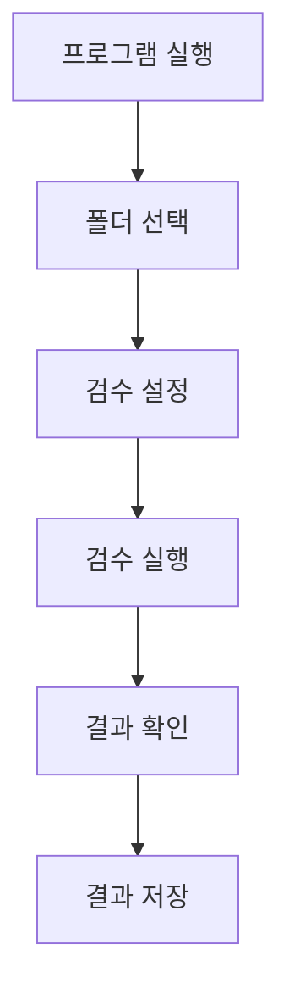

# 사용자 매뉴얼 이미지 가이드

이 문서는 사용자 매뉴얼에 삽입할 이미지의 위치와 내용을 안내합니다.

## 이미지 삽입 위치 및 요구사항

### 1. 초기 실행 화면 (섹션 2.1)

**위치**: `사용자_매뉴얼.md` 섹션 2.1 "프로그램 실행"

**이미지 파일명**: `01_초기_실행_화면.png`

**촬영 요구사항**:
- 프로그램 실행 직후의 메인 화면
- 왼쪽 사이드바 메뉴가 보이도록
- 중앙 영역에 환영 메시지 또는 기본 화면
- 해상도: 최소 1920x1080

**캡션**: "프로그램 초기 실행 화면"

---

### 2. 폴더 선택 화면 (섹션 3.3)

**위치**: `사용자_매뉴얼.md` 섹션 3.3 "폴더 선택 화면"

**이미지 파일명**: `02_폴더_선택_화면.png`

**촬영 요구사항**:
- 폴더 선택 다이얼로그가 열린 상태
- 폴더 경로 입력 필드
- 찾아보기 버튼
- 선택된 폴더 내 .gdb 파일 목록 표시
- 해상도: 최소 1920x1080

**캡션**: "폴더 선택 화면 - 검수할 FileGDB 폴더 선택"

---

### 3. 검수 설정 화면 (섹션 3.4)

**위치**: `사용자_매뉴얼.md` 섹션 3.4 "검수 설정 화면"

**이미지 파일명**: `03_검수_설정_화면.png`

**촬영 요구사항**:
- 검수 설정 화면 전체
- 1~5단계 체크박스 선택 상태
- 각 단계별 세부 규칙 목록
- 검수 옵션 설정 영역
- "검수 진행" 버튼
- 해상도: 최소 1920x1080

**캡션**: "검수 설정 화면 - 검수 단계 및 규칙 선택"

---

### 4. 검수 진행 화면 (섹션 3.5)

**위치**: `사용자_매뉴얼.md` 섹션 3.5 "검수 진행 화면"

**이미지 파일명**: `04_검수_진행_화면.png`

**촬영 요구사항**:
- 검수 진행 중인 화면
- 전체 진행률 바 (80% 정도)
- 단계별 진행률 표시
- 현재 작업 표시 (예: "객체 중복 검사: 1,234/1,500 처리 중")
- 예상 소요 시간 표시
- 취소 버튼
- 해상도: 최소 1920x1080

**캡션**: "검수 진행 화면 - 실시간 진행률 표시"

---

### 5. 검수 결과 화면 (섹션 3.6)

**위치**: `사용자_매뉴얼.md` 섹션 3.6 "검수 결과 화면"

**이미지 파일명**: `05_검수_결과_화면.png`

**촬영 요구사항**:
- 검수 결과 화면 전체
- 대시보드 탭이 선택된 상태
- 전체 검수 요약 카드
- 단계별 요약 카드
- 통계 차트
- 해상도: 최소 1920x1080

**캡션**: "검수 결과 화면 - 대시보드 및 통계"

---

### 6. 1단계 검수 결과 예시 (섹션 4.2.1)

**위치**: `사용자_매뉴얼.md` 섹션 4.2.1 "1단계: 테이블 검수"

**이미지 파일명**: `06_1단계_검수_결과.png`

**촬영 요구사항**:
- 1단계 탭이 선택된 상태
- 테이블 목록 및 검수 결과
- 정상/오류 표시
- 해상도: 최소 1920x1080

**캡션**: "1단계 테이블 검수 결과 예시"

---

### 7. 2단계 검수 결과 예시 (섹션 4.2.2)

**위치**: `사용자_매뉴얼.md` 섹션 4.2.2 "2단계: 스키마 검수"

**이미지 파일명**: `07_2단계_검수_결과.png`

**촬영 요구사항**:
- 2단계 탭이 선택된 상태
- 필드 목록 및 검수 결과
- 오류 상세 정보
- 해상도: 최소 1920x1080

**캡션**: "2단계 스키마 검수 결과 예시"

---

### 8. 3단계 검수 결과 예시 (섹션 4.2.3)

**위치**: `사용자_매뉴얼.md` 섹션 4.2.3 "3단계: 지오메트리 검수"

**이미지 파일명**: `08_3단계_검수_결과.png`

**촬영 요구사항**:
- 3단계 탭이 선택된 상태
- 지오메트리 검수 결과 통계
- 오류 목록
- 해상도: 최소 1920x1080

**캡션**: "3단계 지오메트리 검수 결과 예시"

---

### 9. 4단계 검수 결과 예시 (섹션 4.2.4)

**위치**: `사용자_매뉴얼.md` 섹션 4.2.4 "4단계: 속성 관계 검수"

**이미지 파일명**: `09_4단계_검수_결과.png`

**촬영 요구사항**:
- 4단계 탭이 선택된 상태
- 속성 검수 결과 통계
- 오류 목록
- 해상도: 최소 1920x1080

**캡션**: "4단계 속성 관계 검수 결과 예시"

---

### 10. 5단계 검수 결과 예시 (섹션 4.2.5)

**위치**: `사용자_매뉴얼.md` 섹션 4.2.5 "5단계: 공간 관계 검수"

**이미지 파일명**: `10_5단계_검수_결과.png`

**촬영 요구사항**:
- 5단계 탭이 선택된 상태
- 공간 관계 검수 결과 통계
- 오류 목록
- 해상도: 최소 1920x1080

**캡션**: "5단계 공간 관계 검수 결과 예시"

---

### 11. 대시보드 화면 (섹션 5.1)

**위치**: `사용자_매뉴얼.md` 섹션 5.1 "대시보드 화면"

**이미지 파일명**: `11_대시보드_화면.png`

**촬영 요구사항**:
- 대시보드 탭이 선택된 상태
- 전체 검수 요약 카드
- 단계별 요약 카드
- 통계 차트 (막대 그래프, 파이 차트)
- 해상도: 최소 1920x1080

**캡션**: "검수 결과 대시보드 - 전체 요약 및 통계"

---

### 12. 오류 목록 화면 (섹션 5.2.1)

**위치**: `사용자_매뉴얼.md` 섹션 5.2.1 "오류 목록 확인"

**이미지 파일명**: `12_오류_목록_화면.png`

**촬영 요구사항**:
- 오류 목록 테이블
- 오류 정보 컬럼 (ID, 테이블명, 피처ID, 오류유형, 심각도, 좌표, 메시지)
- 필터 옵션
- 해상도: 최소 1920x1080

**캡션**: "오류 목록 화면 - 상세 오류 정보"

---

### 13. 통계 차트 화면 (섹션 5.2.2)

**위치**: `사용자_매뉴얼.md` 섹션 5.2.2 "통계 차트"

**이미지 파일명**: `13_통계_차트_화면.png`

**촬영 요구사항**:
- 여러 통계 차트 표시
- 단계별 오류 수 막대 그래프
- 오류 유형별 파이 차트
- 심각도별 분포 차트
- 해상도: 최소 1920x1080

**캡션**: "통계 차트 - 오류 유형별 및 심각도별 분포"

---

### 14. GIS 소프트웨어에서 오류 확인 (섹션 5.3.2)

**위치**: `사용자_매뉴얼.md` 섹션 5.3.2 "GIS 소프트웨어에서 확인"

**이미지 파일명**: `14_GIS_오류_확인.png`

**촬영 요구사항**:
- QGIS 또는 ArcGIS 화면
- 원본 FileGDB 레이어
- 오류 Shapefile 레이어
- 오류 위치가 지도에 표시된 상태
- 해상도: 최소 1920x1080

**캡션**: "GIS 소프트웨어에서 오류 위치 확인 (QGIS 예시)"

---

### 15. 보고서 생성 화면 (섹션 5.4.2)

**위치**: `사용자_매뉴얼.md` 섹션 5.4.2 "보고서 생성 방법"

**이미지 파일명**: `15_보고서_생성_화면.png`

**촬영 요구사항**:
- 보고서 생성 다이얼로그
- 보고서 형식 선택 (PDF/HTML)
- 저장 위치 선택
- 해상도: 최소 1920x1080

**캡션**: "보고서 생성 화면"

---

### 16. 생성된 보고서 예시 (섹션 5.4.2)

**위치**: `사용자_매뉴얼.md` 섹션 5.4.2 "보고서 생성 방법"

**이미지 파일명**: `16_생성된_보고서_예시.png`

**촬영 요구사항**:
- 생성된 PDF 또는 HTML 보고서
- 보고서 첫 페이지
- 요약 정보 및 차트 포함
- 해상도: 최소 1920x1080

**캡션**: "생성된 검수 보고서 예시 (PDF)"

---

### 17. 설정 화면 (섹션 6.1.1)

**위치**: `사용자_매뉴얼.md` 섹션 6.1.1 "기본 설정"

**이미지 파일명**: `17_설정_화면.png`

**촬영 요구사항**:
- 설정 창 전체
- 기본 폴더 경로 설정
- 검수 규칙 파일 경로 설정
- 보고서 출력 폴더 설정
- 로그 레벨 설정
- 저장 버튼
- 해상도: 최소 1920x1080

**캡션**: "프로그램 설정 화면"

---

## 이미지 삽입 방법

### 마크다운 형식

```markdown

```

### HTML 형식 (크기 조절 필요 시)

```html

```

## 이미지 파일 구조

```
사용자_매뉴얼/
├── 사용자_매뉴얼.md
├── 사용자_매뉴얼_이미지_가이드.md
└── images/
    ├── 01_초기_실행_화면.png
    ├── 02_폴더_선택_화면.png
    ├── 03_검수_설정_화면.png
    ├── 04_검수_진행_화면.png
    ├── 05_검수_결과_화면.png
    ├── 06_1단계_검수_결과.png
    ├── 07_2단계_검수_결과.png
    ├── 08_3단계_검수_결과.png
    ├── 09_4단계_검수_결과.png
    ├── 10_5단계_검수_결과.png
    ├── 11_대시보드_화면.png
    ├── 12_오류_목록_화면.png
    ├── 13_통계_차트_화면.png
    ├── 14_GIS_오류_확인.png
    ├── 15_보고서_생성_화면.png
    ├── 16_생성된_보고서_예시.png
    └── 17_설정_화면.png
```

## 이미지 촬영 가이드라인

1. **해상도**: 최소 1920x1080 권장
2. **형식**: PNG 형식 사용 (투명도 지원)
3. **품질**: 고해상도로 촬영하여 선명도 확보
4. **개인정보**: 화면에 개인정보나 민감한 정보가 포함되지 않도록 주의
5. **일관성**: 모든 이미지의 UI 스타일 일관성 유지
6. **주석**: 필요 시 화면에 주석이나 화살표 추가

## 프로세스 다이어그램

프로세스 다이어그램은 텍스트 기반 ASCII 아트로 제공되며, 필요 시 Mermaid 다이어그램으로 변환 가능합니다.

### Mermaid 형식 예시



---

**작성일**: 2025-11-18  
**버전**: 1.0

